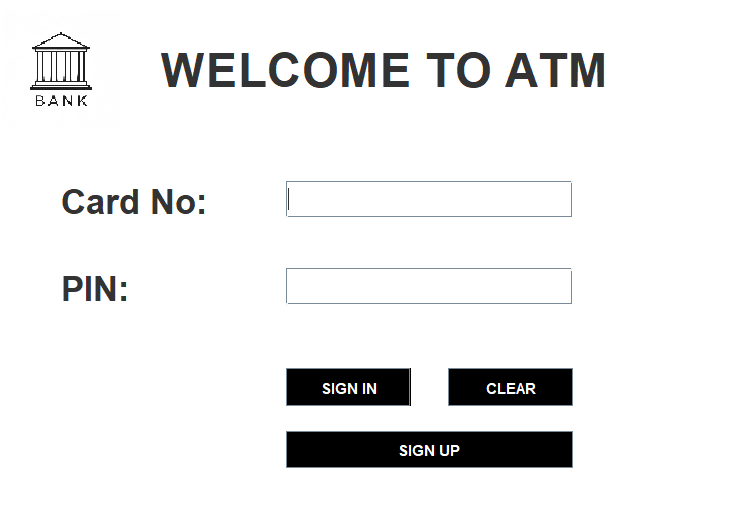
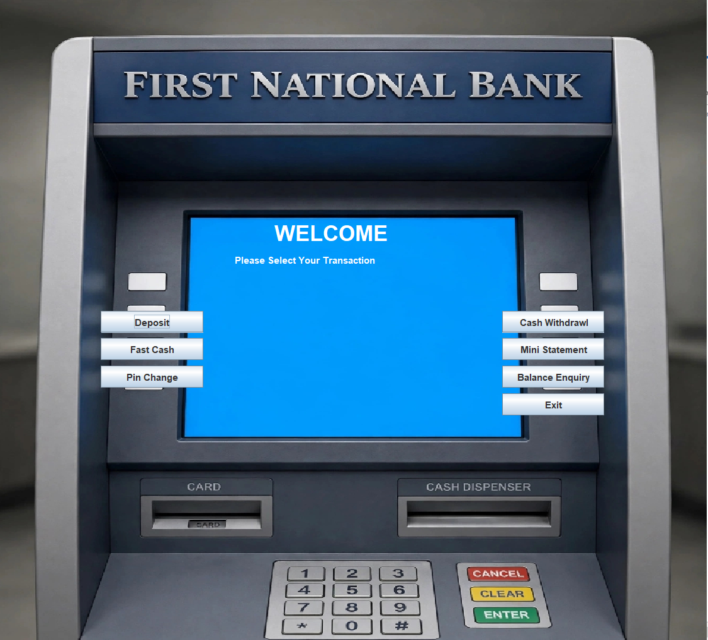
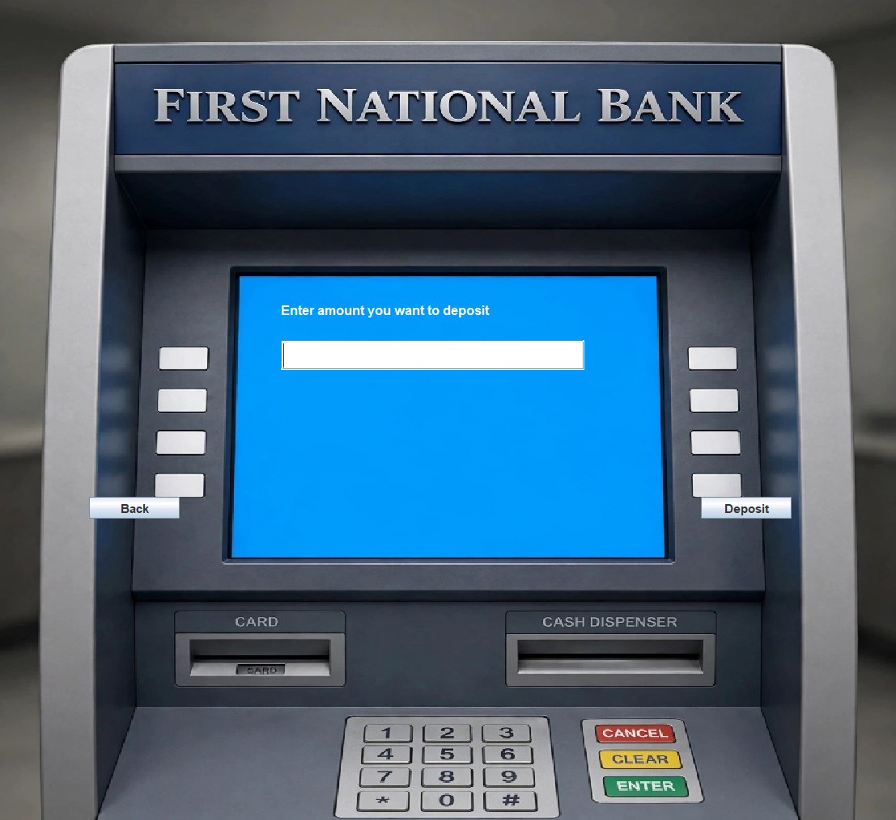
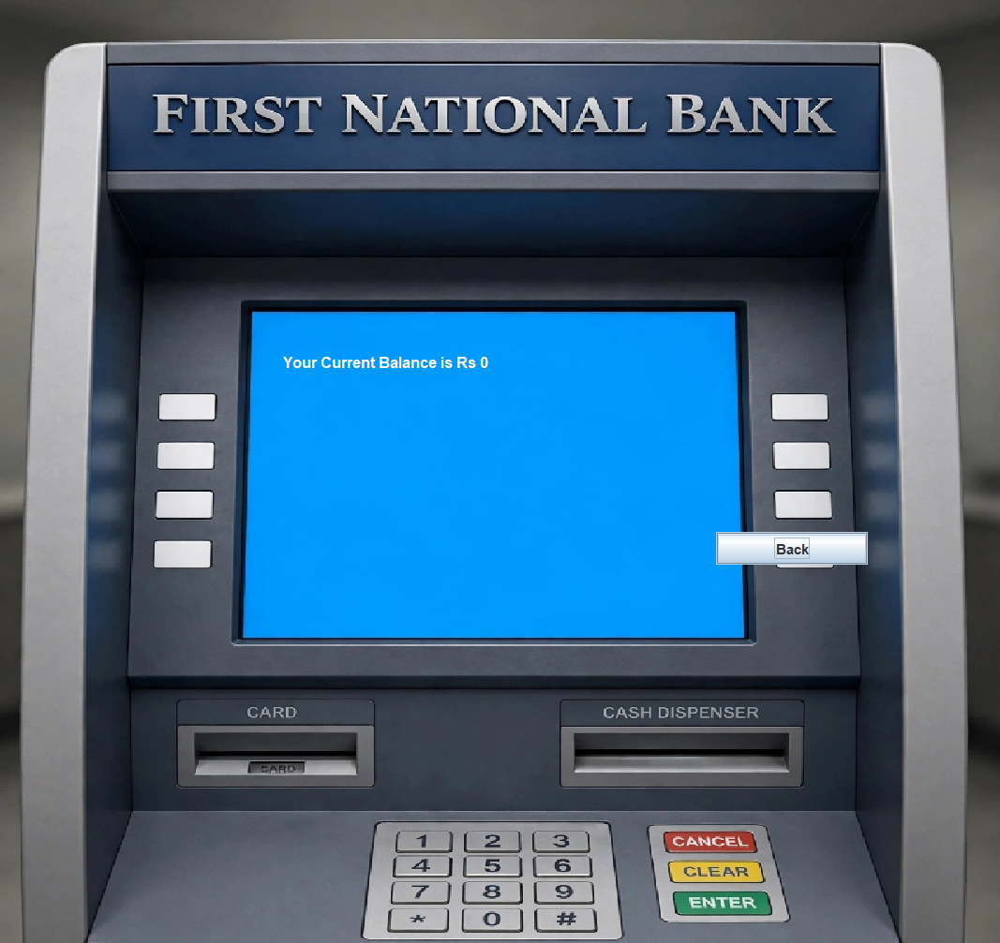

# 🏦 Bank Management System - ATM Simulator
An ATM Interface Simulation built with Java Swing & MySQL. It replicates real ATM operations like account creation, cash deposit, withdrawal and balance enquiry.

### ✨ Key Features
- **Secure Login:** Authentication with Card Number & PIN (`Login.java`)
- **Account Creation:** 3-Step form validation (`SignupOne, Two, Three`)
- **ATM Operations:** Deposit, Withdrawal, Fast Cash
- **Enquiry Services:** Balance Enquiry, Mini Statement, Pin Change
- **Database Driven:** All transactions stored in MySQL (`Conn.java`)

### 📸 Project Screenshots

| Login Screen | Main Menu |
| :---: | :---: |
|  |  |
| **Deposit Screen** | **Balance Enquiry** |
|  |  |

### 🛠️ Tech Stack
- **Language:** Java (JDK 8+)
- **Frontend:** Java Swing, AWT
- **Database:** MySQL
- **Connectivity:** JDBC (`mysql-connector-java-8.0.28.jar`)
- **IDE:** NetBeans / IntelliJ IDEA

### ⚙️ How to Run This Project
1.  Clone the repo: `git clone https://github.com/gayatri02102003-star/bank_management_system.git`
2.  Create Database `bankmanagementsystem` in MySQL and import tables (`login`, `signup`, `bank`)
3.  Open `Conn.java` and update your MySQL username & password
4.  Run `Login.java` as Main File

### 👩‍💻 Author
**Gayatri** - [gayatri02102003-star](https://github.com/gayatri02102003-star)
